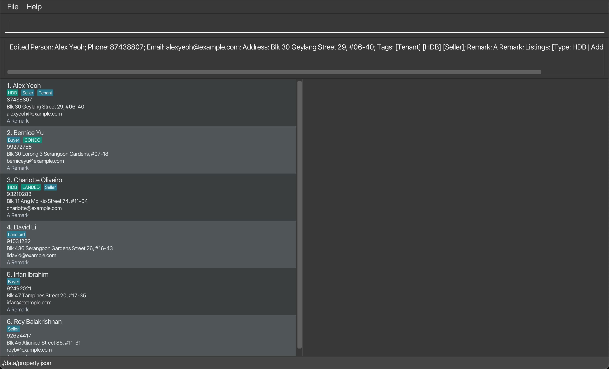
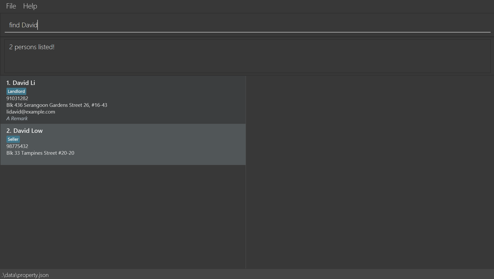
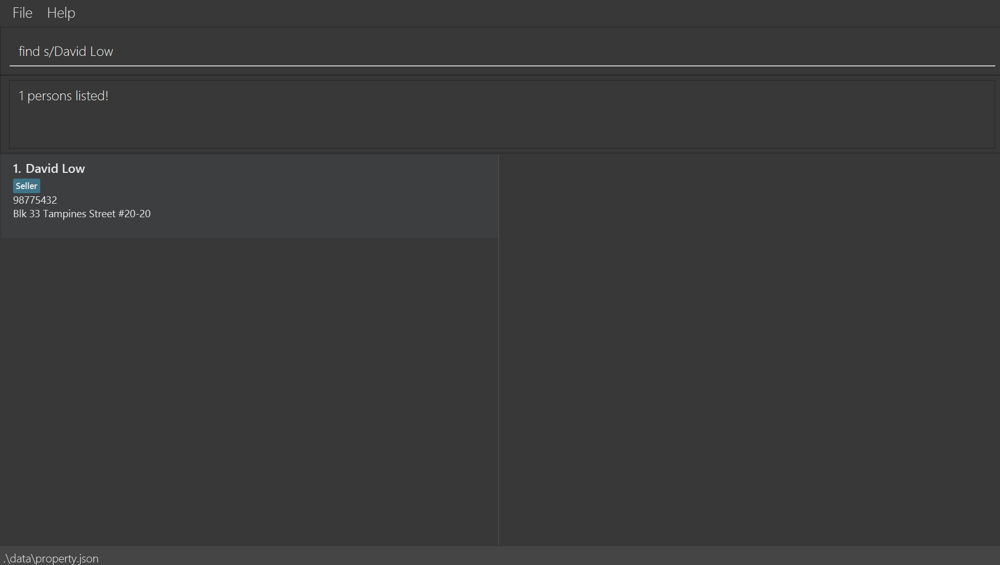
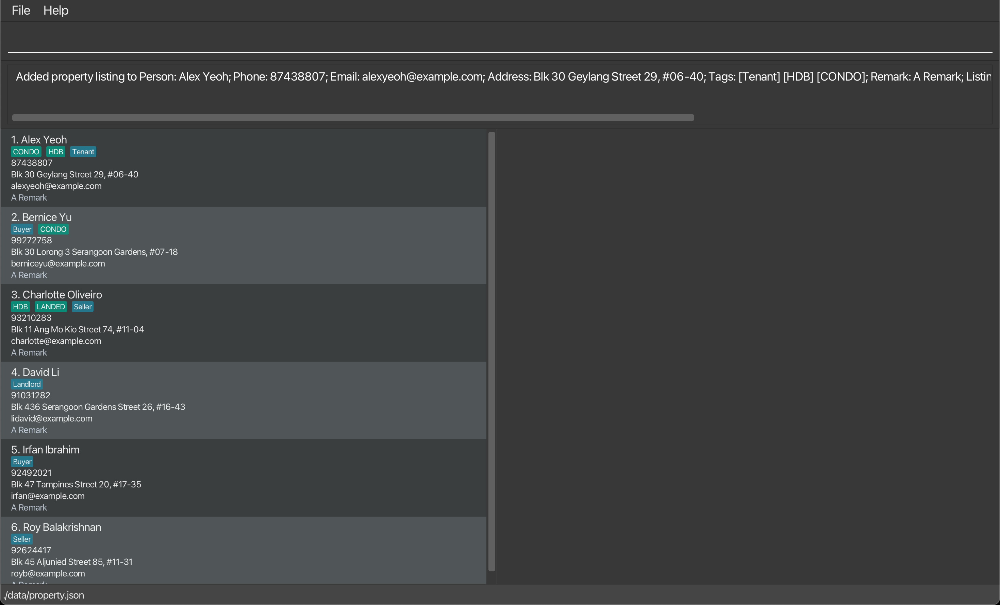
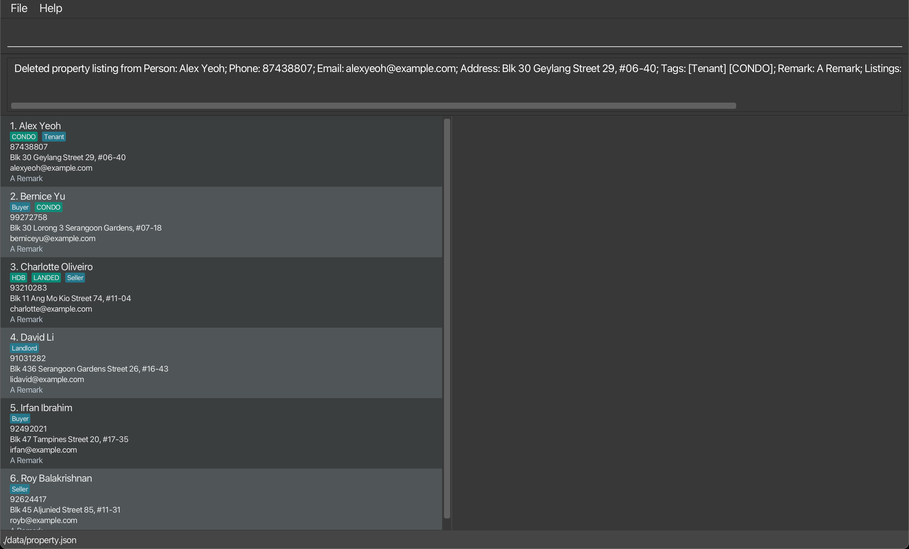

PROperty is a **desktop app for property agents managing contacts and their property listings,
optimized for use via a Command Line Interface** (CLI) while still having the benefits of a Graphical User Interface (GUI).
If you can type fast, PROperty can get your contact and property management tasks done faster than traditional GUI apps.

PROperty is useful for property agents because it saves their time by allowing easy tracking of contacts,
and easily filtering them according to tailor-made categories relevant to property agents in Singapore. It taps on the
fact that it is a lot less complicated to operate than its competitors such as Microsoft Excel while being faster to
operate than graphical user interfaces commonly found in smartphones.

## Table of Contents
* [Quick start](#quick-start)
* [Features](#features)
    * [Adding a client: `add`](#adding-a-client-add)
    * [Listing all clients : `list`](#listing-all-clients--list)
    * [Editing a client : `edit`](#editing-a-client--edit)
    * [Locating clients by name: `find`](#locating-clients-by-name-find)
    * [Locating clients by tag: `findtag`](#locating-clients-by-tag-findtag)
    * [Deleting a client : `delete`](#deleting-a-client--delete)
    * [Clearing all entries : `clear`](#clearing-all-entries--clear)
    * [Exiting the program : `exit`](#exiting-the-program--exit)
    * [Quick reference help: `help`](#quick-reference-help-help)
    * [Managing Remarks : `remark`](#managing-remarks--remark)
    * [Showing property listings of a client : `show`](#showing-property-listings-of-a-client--show)
    * [Adding a property listing : `listing add`](#adding-a-property-listing--listing-add)
    * [Deleting a property listing : `listing delete`](#deleting-a-property-listing--listing-delete)
    * [Exporting your contacts : `export`](#exporting-your-contacts--export)
    * [Sorting all clients : `sort`](#sorting-all-clients--sort)
* [Saving the data](#saving-the-data)
* [Editing the data file](#editing-the-data-file)
* [FAQ](#faq)
* [Known issues](#known-issues)
* [Command summary](#command-summary)
* [Tag Table](#tag-table)
* [Glossary](#glossary)
    * [Property Tags](#property-tags)
    * [client Tags](#client-tags)

--------------------------------------------------------------------------------------------------------------------

## Quick start

1. Ensure you have Java `17` or above installed in your Computer. If not, you can download Java `17` [here](https://www.oracle.com/java/technologies/javase/jdk17-archive-downloads.html).

2. Download the latest `.jar` file from [here](https://github.com/AY2425S1-CS2103T-F15-3/tp/releases).

3. Copy the file to the folder you want to use as the _home folder_ for your PROperty.

4. Double-click on the `.jar` file to run it
   - **For advanced users:** Open a command terminal, `cd` into the folder you put the jar file in, and use the `java -jar PROperty.jar` command to run the application. 

- A GUI similar to the below should appear in a few seconds. Note how the app contains some sample data. 

5. Type the command in the command box and press Enter to execute it. e.g. typing **`help`** and pressing Enter will open the help window. 
   Some example commands you can try:
   
   * `list` : Lists all clients in your address book.
   
   * `add n/John Doe p/98765432 e/johnd@example.com a/John street, block 123, #01-01` : Adds a client named `John Doe` to PROperty.
   
   * `delete 3` : Deletes the 3rd client shown in your current list.
   
   * `clear` : Deletes all clients.
   
   * `exit` : Exits the app.

6. Refer to the [Features](#features) below for details of each command.

--------------------------------------------------------------------------------------------------------------------

## Features

**:information_source: Notes about the command format:** 

* Words in `UPPER_CASE` are the parameters to be supplied by the user. 
  e.g. in `add n/NAME`, `NAME` is a parameter which can be used as `add n/John Doe`.

* Items in square brackets are optional. 
  e.g `n/NAME [t/TAG]` can be used as `n/John Doe t/seller` or as `n/John Doe`.

* Items with `…`​ after them can be used multiple times including zero times. 
  e.g. `[t/TAG]…​` can be used as ` ` (i.e. 0 times), `t/seller`, `t/seller t/landlord` etc.

* Parameters can be in any order. 
  e.g. if the command specifies `n/NAME p/PHONE_NUMBER`, `p/PHONE_NUMBER n/NAME` is also acceptable.

* Extraneous parameters for commands that do not take in parameters (such as `help`, `list`, `exit` and `clear`) will be ignored. 
  e.g. if the command specifies `help 123`, it will be interpreted as `help`.

* If you are using a PDF version of this document, be careful when copying and pasting commands that span multiple lines as space characters surrounding line-breaks may be omitted when copied over to the application.
  

### Adding a client: `add`

Adds a client to PROperty.

Format: `add n/NAME p/PHONE_NUMBER [e/EMAIL] [a/ADDRESS] [t/client_TAG] [r/REMARKS]…​`

- `NAME` and `PHONE_NUMBER` fields must be provided.
-  Refer to the [Tag Table](#tag-table) for a complete list of client tags.

:bulb: **Tip:**
A client can have any number of tags (including no tags)

Examples:

* `add n/John Doe p/98765432 e/johnd@example.com a/John street, block 123, #01-01 r/looking for HDB` adds a client named `John Doe` with a phone number of `98765432`, an email of `johnd@example.com`, an address of `John street, block 123, #01-01` and a remark of `looking for HDB`.

* `add n/Betsy Crowe t/condo e/betsycrowe@example.com a/Flatbush Avenue, block 81, #02-02 p/1234567` adds a client named `Betsy Crowe` with a tag of `Condo`, and email of `betsycrowe@example.com`, an address of `Flatbush Avenue, block 81, #02-02` and a phone number of `1234567`.

Visual example of correct output:

### Editing a client : `edit`

Edits an existing client in the PROperty.

Format: `edit INDEX [n/NAME] [p/PHONE] [e/EMAIL] [a/ADDRESS] [t/client_TAG] [dt/client_TAG] [r/REMARK]…​`

* Edits the client at the specified `INDEX`. The index refers to the index number shown in the displayed client list. The index **must be a positive integer** 1, 2, 3, …​
* `client_TAG` can be `Buyer`, `Seller`, `Landlord`, `Tenant`
* At least one of the optional fields must be provided.
* Existing values will be updated to the input values.
* When editing tags, the tags specified using `t/` will be added to the contact (cumulatively).
* Tags can also be removed using the delete tag `dt/` prefix, followed by the tag name.
* You can remove all the client’s tags by typing `t/` without
    specifying any tags after it.

Examples:

* `edit 1 p/91234567 e/johndoe@example.com` edits the phone number and email address of the `1st` client to be `91234567` and `johndoe@example.com` respectively.

* `edit 2 n/Betsy Crower t/` edits the name of the `2nd` client to be `Betsy Crower` and clears all existing tags.

* `edit 2 t/condo` edits the tag of the `2nd` client to be `condo`.

Visual example of correct output:

### Deleting a client : `delete`

Deletes the specified client from the PROperty.

Format: `delete INDEX`

* Deletes the client at the specified `INDEX`.
* The index refers to the index number shown in the displayed client list.
* The index **must be a positive integer** 1, 2, 3, …​

Examples:

* `list` followed by `delete 2` deletes the 2nd client listed in PROperty.

* `find Betsy` followed by `delete 1` deletes the 1st client in the results of the `find` command.

Visual example of correct output:

### Listing all clients : `list`

Shows a list of all clients in the PROperty.

Format: `list`

Example:

* `list` shows your full client listing in PROperty.

Visual example of correct output:

### Sorting all clients : `sort`

Sorts the list of all clients in PROperty by name in alphabetical order.

Format: `sort`

Example:

* `sort` sorts all your client list in PROperty in alphabetical order.

Visual example of correct output:

### Showing property listings of a client : `show`

Shows the full details of the specified client, including their property listings.

Format: `show INDEX`

- Shows the client at the specified `INDEX`
- The `INDEX` refers to the index number shown in the displayed client list.
- The `INDEX` **must be a positive integer** 1, 2, 3, …​

Examples:

- `show 2` shows the name, client information, tags, and property listings of the second client in the PROperty.

- `show 7` shows the name, client information, tags, and property listings of the seventh client in the PROperty.

Visual example of correct output:

### Quick reference help: `help`

Shows commands in a help menu for quick reference during use of PROperty.

Format: `help`

Example:

- `help` results in a popup window which contains all the commands in PROperty for easy reference during use.

Visual example of correct output:

### Locating clients by name: `find`

Finds clients whose names contain any of the given keywords.

Format: `find KEYWORD [MORE_KEYWORDS]`

* The search is case-insensitive. e.g `hans` will match `Hans`.
* By default, the find command conduct a general search for the individual. Hence, 
the order of the keywords does not matter. e.g. `Hans Bo` will match `Bo Hans`.
* A client's name, phone nunmber, address, email and tag can be searched.
* Only full words will be matched e.g. `Han` will not match `Hans`.
* clients matching at least one keyword will be returned (i.e. `OR` search).
  e.g. `Hans Bo` will return `Hans Gruber`, `Bo Yang`
* If a more specific search is required, utilise the `s/`.
  * Format: `find s/KEYWORD [s/MORE_KEYWORDS]`
  * Only individuals who match the keyword(s) one-to-one will be returned. e.g. `find s/Hans Bo` will not match `Bo Hans`. `find s/Hans Bo` will only match `Hans Bo`.
  * Especially useful if there are multiple clients with the same name in PROperty and you require a more specific search.

Examples:

* `find John` is a general find which returns `John` and `John Doe`.

* `find s/John` is a specific find which only returns `John`.

* `find alex david` is a general find which returns `Alex Yeoh`, `David Li`.

* `find s/Alex Yeoh s/23 Smith Street` is a specific find which only returns `Alex Yeoh` who has `23 Smith Street` as his address.

Visual example of correct output (General Find):

Visual example of correct output (Specific Find):

### Locating clients by tag: `findtag`

Finds clients whose tags contain any of the given words.

Format: `findtag TAG [MORE_TAGS]`

* The search is case-insensitive. e.g., `HDB` will match `hdb`. 
* The order of the tags does not matter. 
* clients with at least one matching tag will be returned (i.e., an `OR` search). 
* List of possible tags you can search for are found in the [Tag Table](#tag-table)

Examples:

* `findtag HDB` returns clients tagged with `HDB`.

* `findtag HDB buyer` returns clients tagged with either `HDB` or `buyer`.

Visual example of correct output:

### Clearing all entries : `clear`

Clears all entries from the PROperty.

Format: `clear`

Example:

* `clear` clears all clients and their data from PROperty.

Visual example of correct output:

### Managing Remarks : `remark`

Adds/removes a remark from a client in PROperty.

Format: `remark INDEX r/[REMARKS]`

* Adds a remark `REMARKS` to the client at `INDEX`
* The index refers to the index number shown in the displayed client list.
* The index **must be a positive integer** 1, 2, 3, …​
* **Note:** `[REMARKS]` will **delete the remark if left blank**

Examples:

* `remark 1 r/Prefers a higher floor apartment` adds a remark "Prefers a higher floor apartment" to the client at index `1`.

* `remark 1 r/` deletes the remark of client at index `1`.

Visual example of correct output (Add Remark):

Visual example of correct output (Remove Remark):

### Adding a property listing : `listing add`

Adds a property listing to the client specified by `INDEX`

Format: `listing add INDEX t/[PROPERTY_TAG] a/[LISTING_ADDRESS]`

- Adds a property listing to the client specified by `INDEX`
- The `INDEX` refers to the index number shown in the displayed client list.
- The `INDEX` **must be a positive integer** 1, 2, 3, …​
- Refer to the [Tag Table](#tag-table) for a complete list of property tags.

Examples:

- `listing add 1 t/condo a/NUS street 123` adds a property listing to the client at index `1` with a listing type of `condo` and address of `NUS street 123`.

- `listing add 2 t/HDB a/Clementi Road 321` adds a property listing to the client at index `2` with a listing type of `HDB` and address of `Clementi Road 321`. 

Visual example of correct output:

### Deleting a property listing : `listing delete`

Deletes the property listing with index `LISTING_INDEX` from the client specified by `INDEX` 

Format: `listing delete INDEX LISTING_INDEX`

* Adds the property listing with index `LISTING_INDEX` to the client specified by `INDEX`
* The `INDEX` refers to the index number shown in the displayed client list.
* The `LISTING_INDEX` refers to the index number shown in the property listing displayed by the `show` command
* The `INDEX`/`LISTING_INDEX` **must be a positive integer** 1, 2, 3, …​

Examples:

- `listing delete 1 1` deletes the `1st` property listing from the client with index `1`.

- `listing delete 2 3` deletes the `3rd` property listing from the client with index `2`.

Visual example of correct output:

### Exporting your contacts : `export`

Exports your contacts and their relevant data to a Comma-Separated Value (CSV) file format.

Format: `export`

* Headings of the CSV file will be the attributes of an individual (ie Name, Address, Phone number etc)
* If an individual listings and/or tags attributed to them, the listings and/or tags are separated by a semicolon.
* By default, the exported CSV file at `[JAR file location]/data/property.csv`

Example:

- `export` exports your current client data in PROperty into a CSV file.

Visual example of correct output:

### Exiting the program : `exit`

Exits the program.

Format: `exit`

* There is no visual example as the programme will close after inputting the `exit` command.

Example:

* `exit` exits PROperty.

### Saving the data

PROperty data are saved in the hard disk automatically after any command that changes the data. There is no need to save manually.

### Editing the data file

PROperty data are saved automatically as a JSON file `[JAR file location]/data/property.json`. Advanced users are welcome to update data directly by editing that data file.

:exclamation: **Caution:**
If your changes to the data file makes its format invalid, PROperty will discard all data and start with an empty data file at the next run. Hence, it is recommended to take a backup of the file before editing it. 
Furthermore, certain edits can cause the PROperty to behave in unexpected ways (e.g., if a value entered is outside of the acceptable range). Therefore, edit the data file only if you are confident that you can update it correctly.

--------------------------------------------------------------------------------------------------------------------

## FAQ

**Q**: How do I transfer my data to another computer? 
**A**: To transfer your data to another computer, follow these steps:

1. **Install PROperty**: Place the `PROperty.jar` file in your preferred location on the new computer.
2. **Set Up the Data Folder**: If you have already run the application, skip to step 3. Otherwise, manually create a `data` folder in the same directory as `PROperty.jar`.
3. **Transfer Your Data**: If the application has been run previously, simply replace the existing `property.json` file in the `data` folder with your data-containing `property.json` file from the original computer. Otherwise, add your `property.json` file directly into the `data` folder you just created.
4. **Launch PROperty**: Run the app to load your transferred data, giving you access to all your previous clients and property listings.

**Q**: Can I customise the tags or categories for clients and properties? 
**A**: Customising tags is not currently supported. Users can only use the predefined tags listed in the table provided in this guide.

**Q**: Is there a way to restore a deleted client? 
**A**: Unfortunately, it is not possible to restore a deleted client. We strongly recommend that you regularly save a backup of your clients to prevent accidental data loss.

--------------------------------------------------------------------------------------------------------------------

## Known issues

1. **When using multiple screens**, if you move the application to a secondary screen, and later switch to using only the primary screen, the GUI will open off-screen. The remedy is to delete the `preferences.json` file created by the application before running the application again.
2. **If you minimize the Help Window** and then run the `help` command (or use the `Help` menu, or the keyboard shortcut `F1`) again, the original Help Window will remain minimized, and no new Help Window will appear. The remedy is to manually restore the minimized Help Window.

--------------------------------------------------------------------------------------------------------------------

## Command summary

| Action             | Format, Examples                                                                                                                                                                |
|--------------------|---------------------------------------------------------------------------------------------------------------------------------------------------------------------------------|
| **Add**            | `add n/NAME p/PHONE_NUMBER [e/EMAIL] [a/ADDRESS] [t/client_TAG] [r/REMARKS]…​`   e.g., `add n/James Ho p/22224444 e/jamesho@example.com a/123, Clementi Rd, 1234665 t/buyer` |
| **List**           | `list`                                                                                                                                                                          |
| **Edit**           | `edit INDEX [n/NAME] [p/PHONE] [e/EMAIL] [a/ADDRESS] [t/client_TAG] [dt/client_TAG] [r/REMARK]…​`  e.g., `edit 2 n/James Lee e/jameslee@example.com`                         |
| **Find**           | `find KEYWORD [MORE_KEYWORDS]` `find s/KEYWORD [s/MORE_KEYWORDS]`  e.g., `find James Jake`, `find s/James Jake s/23 Philip Street`                                       |
| **Findtag**        | `findtag TAG [MORE_TAGS]`  e.g., `findtag hdb buyer`                                                                                                                         |
| **Delete**         | `delete INDEX`  e.g., `delete 3`                                                                                                                                             |
| **Clear**          | `clear`                                                                                                                                                                         |
| **Exit**           | `exit`                                                                                                                                                                          |
| **Help**           | `help`                                                                                                                                                                          |
| **Remark**         | `remark INDEX r/[REMARKS]`  e.g., `remark 1 r/Prefers a higher floor apartment`, `remark 1 r/` (to delete the remark)                                                        |
| **Show**           | `show INDEX`  e.g., `show 2`                                                                                                                                                 |
| **Add Listing**    | `listing add INDEX t/[PROPERTY_TAG] a/[LISTING_ADDRESS]`  e.g., `listing add 1 t/condo a/123 NUS Street`                                                                     |
| **Delete Listing** | `listing delete INDEX LISTING_INDEX `  e.g., `listing delete 1 1`                                                                                                            |
| **Export**         | `export`                                                                                                                                                                        |
| **Sort**           | `sort`                                                                                                                                                                          |

--------------------------------------------------------------------------------------------------------------------

## Tag Table

| Tag Type | Tags                                                                                                                                                                      |
|----------|--------------------------------------------------------------------------------------------------------------------------------------------------------------------------|
| Property | HDB, CONDO, RESIDENTIAL, LANDED, EC, COMMERCIAL, RETAIL, INDUSTRIAL, OFFICE, WAREHOUSE, SHOPHOUSE, TERRACE, SEMIDET, BUNGALOW, DETACHED, GCB, PENTHOUSE, MIXED, SERVAPT, DORM |
| Client   | BUYER, SELLER, LANDLORD, TENANT, DEVELOPER, INVESTOR, MANAGER, CONTRACTOR                                                                                                 |

--------------------------------------------------------------------------------------------------------------------

## Glossary

### Property Tags
- **HDB**: Public housing flats governed by the Housing & Development Board.
- **CONDO**: Private residential units with shared amenities.
- **RESIDENTIAL**: Properties intended for residential use.
- **LANDED**: Homes built on their own land, without shared walls (e.g., bungalows, terraces).
- **EC**: Executive Condominium – a subsidised option bridging public and private property.
- **COMMERCIAL**: Properties zoned for business operations.
- **RETAIL**: Space designated for shops and consumer-facing businesses.
- **INDUSTRIAL**: Sites for manufacturing, logistics, and heavy industry activities.
- **OFFICE**: Office spaces designed for corporate or business use.
- **WAREHOUSE**: Dedicated to storage and logistical operations.
- **SHOPHOUSE**: Multi-use buildings with commercial space on the ground floor, residential above.
- **TERRACE**: Row houses sharing side walls, commonly in clusters.
- **SEMIDET**: Semi-detached houses sharing one side wall.
- **BUNGALOW**: Single-story, standalone homes, often with private land.
- **DETACHED**: Fully standalone houses, no shared walls.
- **GCB**: Good Class Bungalows – high-end, exclusive bungalows with strict land requirements.
- **PENTHOUSE**: Premium top-floor units, typically in condos, with added privacy and amenities.
- **MIXED**: Properties combining multiple zoning uses, like residential and commercial.
- **SERVAPT**: Furnished serviced apartments, typically with extended-stay services.
- **DORM**: Dormitories, often used as shared housing for students or workers.

### Client Tags
- **BUYER**: Prospective property purchasers.
- **SELLER**: Property owners seeking to sell.
- **LANDLORD**: Property owners leasing to tenants.
- **TENANT**: Individuals or entities renting properties.
- **DEVELOPER**: Companies or individuals creating or renovating properties.
- **INVESTOR**: Individuals or groups acquiring property for financial gain.
- **MANAGER**: Those managing property operations, tenant relations, or maintenance.
- **CONTRACTOR**: Professionals providing construction, renovation, or repair services.
